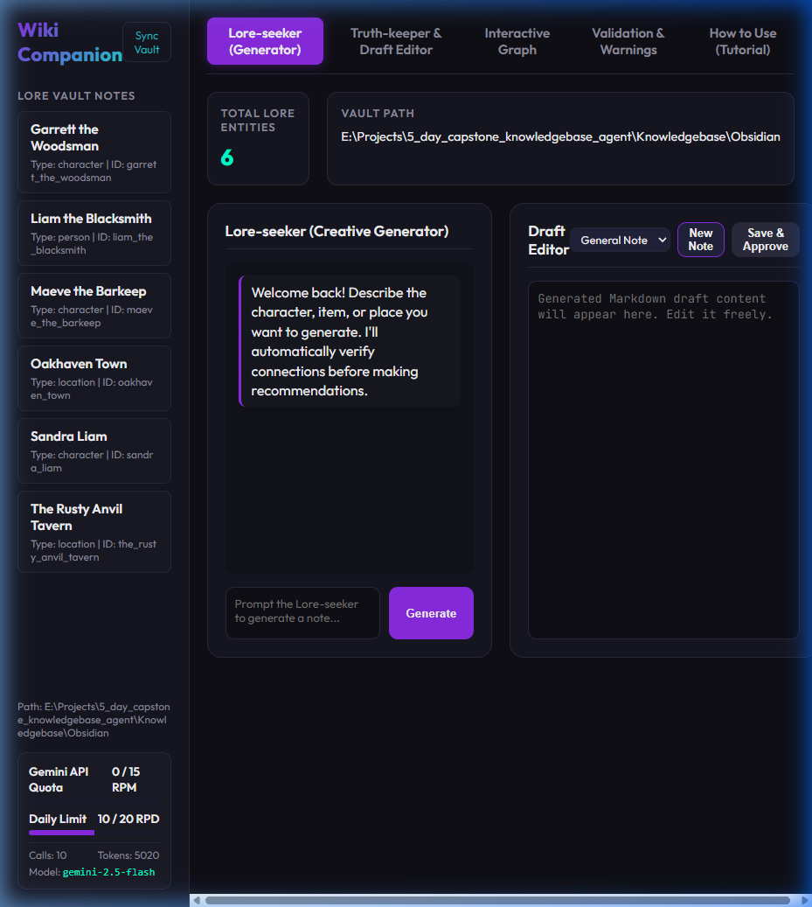
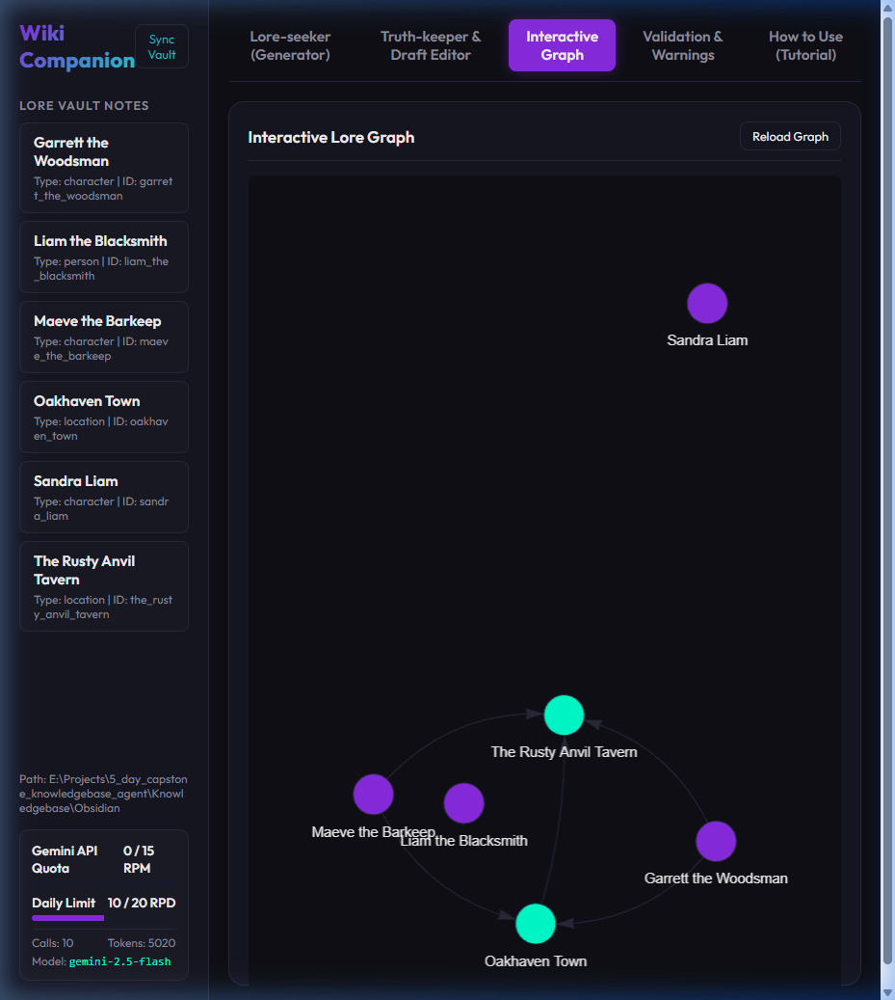

# Obsidian Lore Companion 🌟

The **Obsidian Lore Companion** is an agentic worldbuilding assistant and validation tool designed to manage, expand, and enforce consistency within an Obsidian lore wiki vault. It parses notes (characters, locations, factions, and items) from your vault, registers them into a local SQLite database, and runs deterministic static checks alongside two specialized cooperative agents to ensure your world's logic stays intact.

---

## 📸 Interface Preview

### Twin Editors & Chat Workspace


### Interactive Relationship Graph


---

## 🚀 Key Features

1. **Deterministic Static Consistency Checks**:
   * **Broken Links**: Detects wiki links `[[Link]]` pointing to missing notes.
   * **Lifespan/Timeline Violations**: Flags characters with negative ages, birth eras after death eras, or lifespans exceeding species-specific boundaries (Humans: 150 years, Dwarves: 350 years, Orcs: 80 years, Elves: 1000 years).
   * **Missing Required Fields**: Flags notes missing template-level fields (e.g. status, age, region, place_type, rarity).
   * **Fuzzy Duplicate Detection**: Detects notes with similar names (>= 80% similarity threshold) or high body text duplication to catch spelling mistakes and typos.

2. **Dual-Agent Architecture**:
   * **Lore-seeker (Creative Generator)**: Queries the database using tools to research existing entities, helps write new lore, suggests names, and outputs clean Markdown templates matching schemas.
   * **Truth-keeper (Consistency Gatekeeper)**: Compares draft modifications or full files against existing facts, checks for logical or semantic contradictions (e.g. chronological errors), and validates name uniqueness.

3. **Isolated Agent Sub-Skills**:
   * **Note Formatter (`format_note_draft`)**: Clean Python tool for formatting raw text draft inputs into valid YAML frontmatter note schemas.
   * **Contradiction Analyst (`analyze_contradictions`)**: Isolated contradiction checker that executes checks against database facts.
   * **Thematic Name Generator (`generate_random_name`)**: A fast, token-free utility that provides name suggestions (Elves, Dwarves, Humans, Dark/Nature Locations, Items, Factions) directly to the Lore-seeker.

4. **Interactive vis.js Relationship Graph**:
   * Renders color-coded nodes based on entity types (Purple: Characters, Teal: Locations, Orange: Items, Red: Factions).
   * Supports dragging, zooming, and spacing parameters tuned to prevent overlaps.
   * **Double-click** any node in the graph to load it instantly into the active draft editor and navigate directly to the editor workspace.

5. **LLM Usage Sidebar & Quota Tracker**:
   * Real-time tracking of Requests Per Minute (RPM) and Daily Limits (RPD) to stay within Gemini API free tiers.
   * Handles API rate limits gracefully, displaying helpful fantasy fallback messages instead of empty outputs.

---

## 🛠️ Project Structure

```
my-agent/
├── app/
│   ├── agent.py            # Agent definitions, sub-skills, & schemas
│   ├── database.py         # SQLite connection and migration helpers
│   ├── parser.py           # Markdown frontmatter parsing and DB synchronization
│   ├── validators.py       # Deterministic static validator checks
│   └── web_ui.py           # FastAPI backend & single-page HTML application
├── docs/
│   └── images/             # User interface screenshots
├── tests/
│   └── unit/               # Local test suite covering validators and parser
├── run.py                  # Entrypoint script to start the web app
└── pyproject.toml          # Python dependencies
```

---

## ⚙️ Setup and Installation

### Prerequisites
* **Python 3.12+**
* **uv**: Fast Python package manager ([Install Guide](https://docs.astral.sh/uv/getting-started/installation/))

### Installation
1. Clone the repository and navigate to the project directory:
   ```bash
   cd my-agent
   ```
2. Set up your environment variables by creating a `.env` file in the workspace root:
   ```env
   GEMINI_API_KEY="your_api_key_here"
   GEMINI_MODEL="gemini-2.5-flash"
   ```

3. Install the dependencies:
   ```bash
   uv sync
   ```

---

## 🖥️ Running the Application

To launch the web interface local server:
```bash
uv run python run.py
```
Open your browser and navigate to: **`http://127.0.0.1:8000`**

---

## 🧪 Testing

The project contains unit tests covering all static validators (timeline checks, duplicate checking, schema templates, and cross-references). 

To execute the unit test suite:
```bash
uv run pytest tests/unit/
```
