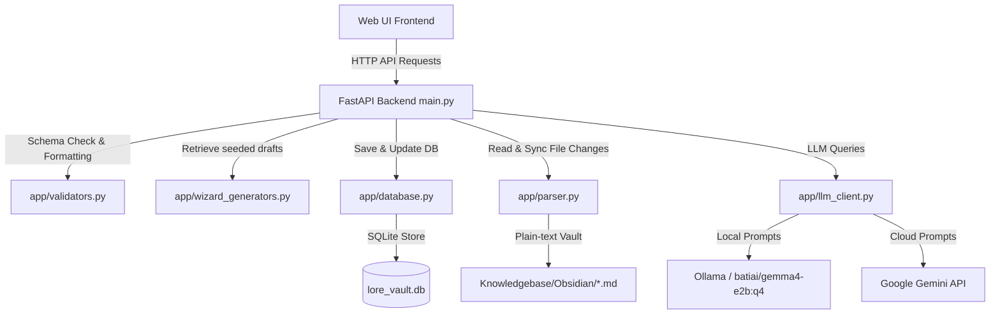

# Lore Vault Studio: Relational Worldbuilding Wiki & Assistant

Welcome to **Lore Vault Studio**, a specialized fey-worldbuilding wiki and AI assistant designed to help writers, worldbuilders, and game masters construct, query, and logically validate complex fictional universes. 

It bridges a plain-text markdown database (**Obsidian Vault**) with a relational graph index (**SQLite**), offering structured procedural note generation, deep context RAG queries, and real-time consistency checks.

---

## 1. High-Level Architecture

Lore Vault Studio is built using a decoupled architecture, dividing worldbuilding actions into structured wizard-driven generation, plain-text file storage, relational indexing, and clean model prompting:



---

## 2. Core Features & Core Code Components

### 1. Multi-Step Note Wizard Modal
Create new worldbuilding elements using a 4-step wizard interface rather than relying on abstract chat prompting:
- **Choose Type (Step 1):** Select from 7 defined schemas: *Character*, *Location*, *Item*, *Faction*, *Event*, *Species*, or *General*.
- **Edit Metadata (Step 2):** Seed fields are populated automatically by a procedural fantasy generator in [wizard_generators.py](file:///e:/Projects/5_day_capstone_knowledgebase_agent/my-agent/app/wizard_generators.py) (e.g., first/last name lists, biomes, relics). You can review and tweak these fields.
- **Generate Lore (Step 3):** Only the validated metadata is sent to the LLM to write the summary and description, minimizing hallucinations. Includes a **🔄 Regenerate Content** button with custom directions.
- **Review & Save (Step 4):** Displays the raw JSON for inspection before saving.
- *Controls:* Managed in [wizard_controller.js](file:///e:/Projects/5_day_capstone_knowledgebase_agent/my-agent/app/static/js/wizard_controller.js).

### 2. Stub Completion Wizard
When you create links to future files (e.g., `[[Mages Guild]]`), the system automatically registers them as dotted-border "stubs" in the graph database. 
- Opening an empty stub file in the editor displays a blue **⚡ Complete with Wizard** button.
- Clicking it opens the Stepper Wizard pre-populated with the stub's name, overriding the random name generators in Step 2 while procedurally seeding the remaining fields.
- *Controls:* Configured inside [ui_state.js](file:///e:/Projects/5_day_capstone_knowledgebase_agent/my-agent/app/static/js/ui_state.js) and [wizard_controller.js](file:///e:/Projects/5_day_capstone_knowledgebase_agent/my-agent/app/static/js/wizard_controller.js).

### 3. Decoupled Dual-Mode Chat Utility
All note-drafting operations are completely isolated to the Wizard, keeping the Chat panel focused purely on information retrieval and brainstorming:
- **Lore Base (RAG Mode):** Queries database relations using [lore_seeker.py](file:///e:/Projects/5_day_capstone_knowledgebase_agent/my-agent/app/agents/lore_seeker.py). If no entity is open, it automatically scans your query for mentioned entity names, pulls their graphs from [context_tools.py](file:///e:/Projects/5_day_capstone_knowledgebase_agent/my-agent/app/context_tools.py), and constructs the context for the model.
- **Direct LLM (Text Mode):** Directly prompts the LLM for general brainstorming (e.g. *"Write a fantasy haiku"*), completely bypassing database queries and tool calls to speed up response time.
- *Controls:* Selector tabs at the bottom of the chat panel in [index.html](file:///e:/Projects/5_day_capstone_knowledgebase_agent/my-agent/app/static/index.html).

### 4. Strict Wikilinks Standards & Auto-Formatting
All entity-referencing metadata properties (e.g., `current_location`, `species`, `controlling_faction`, `faction_affiliations`) are enforced as Obsidian double-bracket links.
- The validator [validators.py](file:///e:/Projects/5_day_capstone_knowledgebase_agent/my-agent/app/validators.py) runs `ensure_wikilinks_in_metadata` on save, automatically wrapping plain-text inputs in double brackets.
- The parser [parser.py](file:///e:/Projects/5_day_capstone_knowledgebase_agent/my-agent/app/parser.py) handles double-bracket strings safely (distinguishing `[[Elves]]` from array lists) and extracts relations from both the YAML frontmatter block and the markdown body.

### 5. Cascade Protection & Connections Maintenance Dialog
SQLite's `INSERT OR REPLACE` deletes existing rows before inserting, which triggers a `CASCADE DELETE` on any foreign keys targeting that row in other tables.
- **Database Refactor:** `insert_entity` in [database.py](file:///e:/Projects/5_day_capstone_knowledgebase_agent/my-agent/app/database.py) uses `ON CONFLICT(name) DO UPDATE` to modify entities in-place, preserving incoming connections.
- **Incoming connections review modal:** Saving a note that is referenced by other notes prompts a checklist overlay. You can choose which incoming links to maintain or forget in the database, with handy "Maintain All" and "Forget All" buttons.
- *Controls:* Handled via `/api/entity/{name}/incoming` in [main.py](file:///e:/Projects/5_day_capstone_knowledgebase_agent/my-agent/main.py) and rendered in [ui_state.js](file:///e:/Projects/5_day_capstone_knowledgebase_agent/my-agent/app/static/js/ui_state.js).

### 6. Prompt Injection Sanitization & Security
To ensure application safety and prevent adversarial prompt manipulation:
- **Scanner:** `LLMClient.generate` in [app/llm_client.py](file:///e:/Projects/5_day_capstone_knowledgebase_agent/my-agent/app/llm_client.py) runs `check_prompt_injection` to scan prompts against common injection regex patterns (e.g. `ignore all previous instructions`, `system override`).
- **Error Handling:** If an injection pattern is detected, it raises `SecurityException`. The API endpoints catch this exception and return a clean, non-blocking HTTP error response envelope instead of crashing or hanging.

---

## 3. Directory Map

Key files and folders in the workspace:

```bash
my-agent/
├── app/
│   ├── agents/
│   │   ├── editor_agent.py      # LLM generator for wizard summary/content
│   │   ├── linker_agent.py      # Automatically inserts wikilinks into text
│   │   ├── lore_seeker.py       # RAG querying engine (with entity auto-scans)
│   │   ├── orchestrator.py      # Router agent
│   │   └── truth_keeper.py      # Logic validator checking lore consistency
│   ├── static/
│   │   ├── js/
│   │   │   ├── ui_state.js      # Main editor UI events & connections checklist
│   │   │   └── wizard_controller.js # Modal wizard stepper logic & stub inputs
│   │   ├── styles/
│   │   └── index.html           # Main studio application markup
│   ├── context_tools.py         # Subgraph relation-extraction tools
│   ├── database.py              # SQLite schema, indices, conflict actions
│   ├── file_writer.py           # Obsidian markdown files formatting/writing
│   ├── llm_client.py            # Centralized client for Gemini & Ollama APIs
│   ├── parser.py                # Frontmatter reader & wikilinks parser
│   ├── validators.py            # Pydantic schemas, fuzzy enums, auto-wrapping
│   └── wizard_generators.py     # Procedural seed generator lists & logic
├── tests/
│   ├── conftest.py              # Pytest setup, isolated paths, DB cleanup fixtures
│   ├── eval/
│   │   ├── datasets/
│   │   │   └── basic-dataset.json # Quality evaluation prompts dataset
│   │   ├── eval_config.yaml     # Prompt quality metric configs
│   │   └── run_evals.py         # Live/mock grading quality harness script
│   ├── integration/
│   │   └── test_api.py          # FastAPI mock clients endpoint tests
│   └── unit/
│       ├── test_database.py     # SQLite operations unit tests
│       ├── test_parser.py       # Frontmatter & wikilinks unit tests
│       ├── test_security.py     # Prompt injection unit tests
│       ├── test_validators.py   # Spelling corrections & wrap checks
│       └── test_wizard.py       # Seed generator unit tests
├── main.py                      # FastAPI server routes, lifespans, API entry
├── seed_vault.py                # Database and vault markdown seeds script
└── pyproject.toml               # Poetry/UV dependency configuration
```

---

## 4. Getting Started

### 1. Requirements
Ensure you have Python 3.10+ and `uv` (or `pip`) installed. 

Create a `.env` file in the project root:
```env
GEMINI_API_KEY=your_google_gemini_key_here
```

*Note: If `GEMINI_API_KEY` is not provided, the server will default to your local Ollama instance utilizing the `batiai/gemma4-e2b:q4` model.*

### 2. Installation & Run
Start the development server:
```bash
cd my-agent
uv pip install -e .
uv run uvicorn main:app --reload
```
Open your browser to `http://localhost:8000`.

### 3. Seed/Wipe the Vault
To wipe all active vault files and start with a fresh set of validated worldbuilding notes:
```bash
cd my-agent
uv run python seed_vault.py
```
This writes the base markdown files into `Knowledgebase/Obsidian/` and automatically synchronizes the SQLite tables.

---

## 5. Testing & Evaluation

### Running Automated Tests
The pytest suite runs fully offline, using an isolated temporary test vault directory and database, with mocked LLM calls:
```bash
cd my-agent
uv run pytest
```

### Running Response Quality Evaluations
To grade the LLM's answers against the evaluation prompt rubric defined in `eval_config.yaml`:
```bash
cd my-agent
uv run python tests/eval/run_evals.py
```
This runs the dataset cases and generates a complete Markdown quality report in the artifacts directory.
